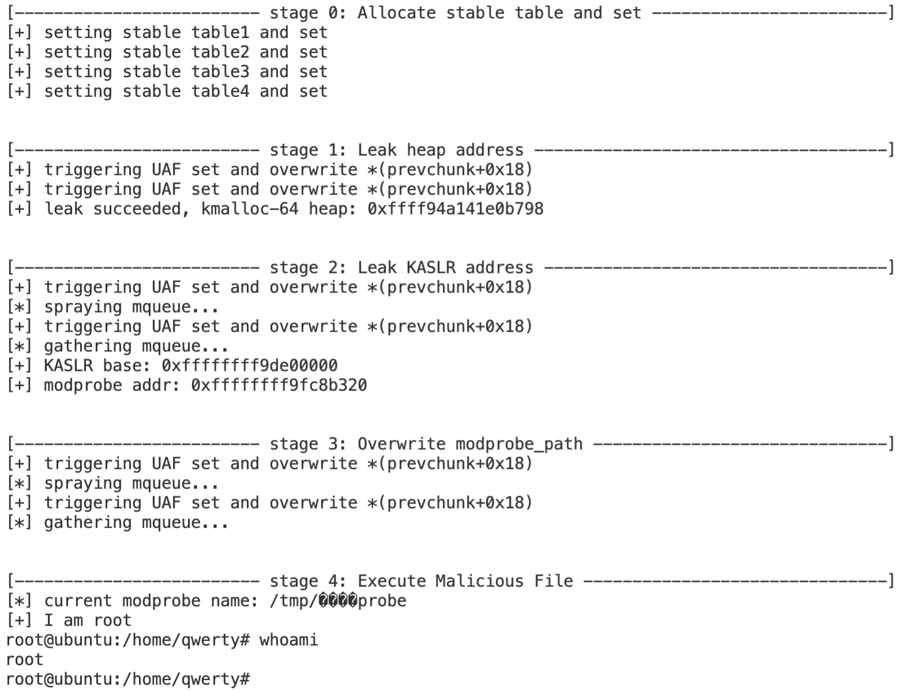

# CVE-2022-32250-Linux-Kernel-LPE

## Demo Video

https://www.youtube.com/watch?v=YqmwA6fPjKE

## About
- CVE-2022-32250 allows a local user to escalate privileges to root because an incorrect NFT_STATEFUL_EXPR check leads to a use-after-free.

## Reference
- [Linux Kerenel Exploit (CVE-2022-32250) with mqueue](https://blog.theori.io/research/CVE-2022-32250-linux-kernel-lpe-2022/)

## Affected Version
- Linux, before commit 520778042ccca019f3ffa136dd0ca565c486cedd (26 May, 2022)
- Ubuntu <= 22.04 before security patch

## Test Environment & Running

### Test Environment
- Platform
    - Ubuntu 22.04 amd64
- Versions
    - Linux ubuntu 5.15.0-27-generic #28-Ubuntu SMP Thu Apr 14 04:55:28 UTC 2022 x86_64 x86_64 x86_64 GNU/Linux

### Running
```
gcc exp.c -o exp -l mnl -l nftnl -w
./exp
```

## Warning
- This exploit corrupts Linux kernel slabs, which might cause kernel panic when attempting to acquire root privileges.

## Result

